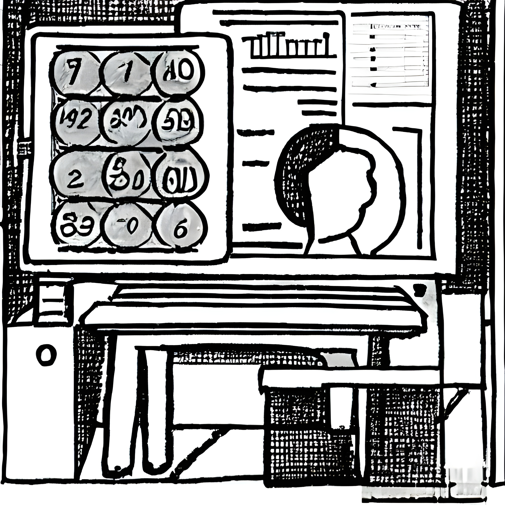

 

I'm a Lecturer and research fellow at the [University of Queensland's School of Veterinary Science](https://researchers.uq.edu.au/researcher/15140). I am broadly interested in exploring new ways to (1) understand how ecological communities are formed and (2) predict how they will change over time.

 
#  

 - 🛠️ I maintain the R 📦 [{mvgam}](https://nicholasjclark.github.io/mvgam/) for Bayesian time series modelling and forecasting. [Here is an introductory webinar showing what mvgam does](https://www.youtube.com/watch?v=RwllLjgPUmM&list=PLzFHNoUxkCvtIGABuakH_T5CLVZPedaXQ&index=3) 
 - :chart: I also teach workshops on Generalized Additive Models (GAMs) and time series analysis
- 💬 Ask me about coffee, tennis and quantitative ecology
 - :computer: I mostly program in R and Stan, and maintain [a small blog on modeling with these tools](https://ecogambler.netlify.app/)
- 😄 Pronouns: He / Him

I'm actively seeking Honours and PhD students to work in the areas of ecological forecasting, multivariate model evaluation, hierarchical GAMs and development of {mvgam}. Please reach out if you are interested
